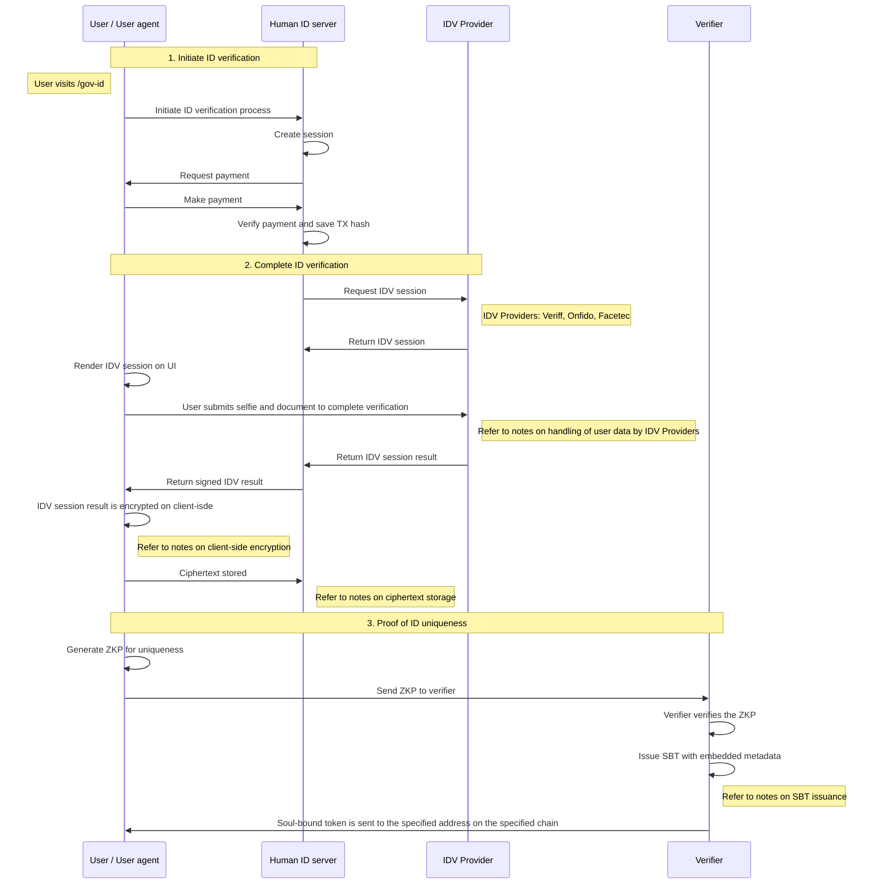

# Flow of Data: KYC Proof of Personhood

Human ID's Proof of Personhood via KYC consists of the following components:

* User agent (UI)
* Human ID server
* ID verification provider
* Verifier

The flow of data is outlined in the following sequence diagram. Please refer to notes for detailed explanations for relevant parts.



#### Issuance and Proving

Sections 1 and 2 in the sequence diagram constitute _issuance_. This is where the user's private credentials are issued.

Section 3 is proving, where the user proves facts about their issued credentials.

#### Notes on handling of user data by IDV Providers

Following data are requested by IDV providers as photo or/and video stream during the verification process.

* Selfie (photo, video stream)
* One of the following documents
  * Passport
  * Driver License
  * Identity Card

Currently, following IDV providers are supported.

* [Veriff](https://trust.veriff.com/)
* [Onfido](https://onfido.com/privacy/)
* [Facetec](https://dev.facetec.com/privacy-site)

**Veriff** has clearly outlined in its [trust center](https://trust.veriff.com/)

* a list of compliances (i.e: GDPR)
* regarding data collection, retention and deletion [controls](https://trust.veriff.com/controls#data-and-privacy)
  * a list of [subprocessors](https://trust.veriff.com/controls#documentation)

**Onfido** has its [privacy policy](https://onfido.com/privacy/)

* a list of [compliances](https://onfido.com/company/certifications/)
* regarding data
  * [collection](https://onfido.com/privacy/#toc-2-the-information-we-collect-and-how-we-use-it-on-behalf-of-our-clients-3)
  * [processing](https://onfido.com/privacy/#toc-3-using-information-as-controller-4)
  * [security](https://onfido.com/privacy/#toc-5-information-security-6)
  * [storage](https://onfido.com/privacy/#toc-6-data-storage-7)
* ControlCase has issued compliance certificate for ISO 27001

**Facetec** has two privacy policies ([site](https://dev.facetec.com/privacy-site) and [sdk](https://dev.facetec.com/privacy-sdk))

> _SDK privacy policy seems more relevant for usage for ID verification. Its documentation on privacy is sparse compared to the other 2 providers._

* In article #2, it mentions that any data sent to its server is encrypted, siloed and is never stored with any additional personally identifiable information (PII).
* In article #6, it provides detailed info on its compliance to GDPR for EU residents.

#### Notes on client-side encryption of IDV session result

IDV provider returns the session result to user.

With Human Wallet:

The result is encrypted on client-side using a derivative of the PRF.

With other wallets:

The result is encrypted with key derived with `hash(userSignature(aConstantMessage))` to generate ciphertext.

#### Notes on ciphertext and storage of userCredentials

Only the encrypted ciphertext which is non PII is stored in Human ID database as below.

```json
// userCredentialsv2
{
  "_id": {
    "$oid": "676d..."
  },
  "holoUserId": "f111...",
  "encryptedGovIdCreds": {
    "ciphertext": "0x...",
    "iv": "0x...",
    "_id": {
      "$oid": "676d..."
    }
  },
  "__v": {
    "$numberInt": "0"
  }
}

```

View [#government-id-issuer](../how-it-works/credentials.md#government-id-issuer "mention")to see the data included in user credentials.

#### Notes on verifier and SBT issuance

The user submits a zero knowledge proof of uniqueness ([see the circuit here](https://github.com/holonym-foundation/id-hub-contracts/blob/main/zk/circuits/circom/V3SybilResistance.circom)) to the verifier server. The verifier verifies the ZKP, and upon verification, issues a soulbound token to the user. The circuit ID, issuer address, expiry, and actionNullifier, the ZK proof are embedded in the Soul-bound token.
